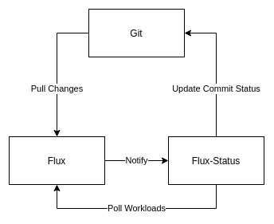

# Flux Status

Flux Status is a event exporter for Flux.

  

## How To
The simplest way to run Flux Status is as a sidecar in the Flux Pod, as it simplifies the lifecycle
management as the container will be created with Flux.

## License
This project is licensed under the MIT License - see the [LICENSE](LICENSE) file for details.
